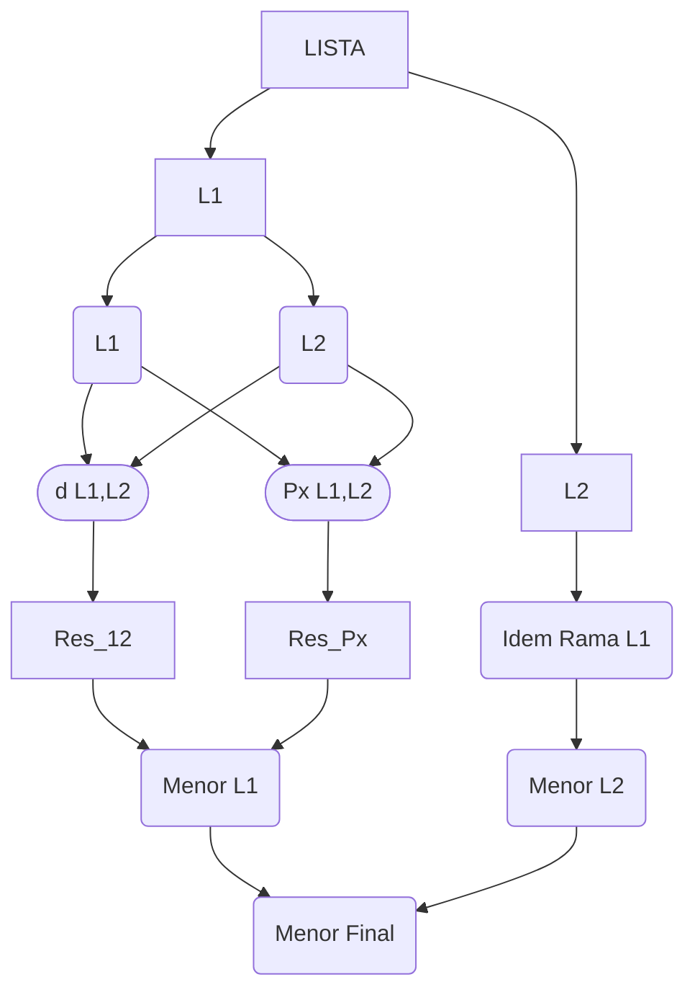
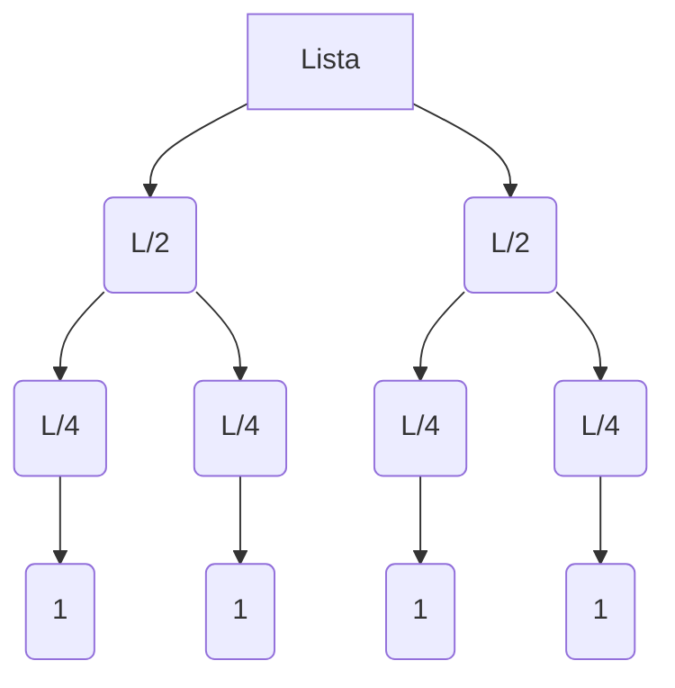
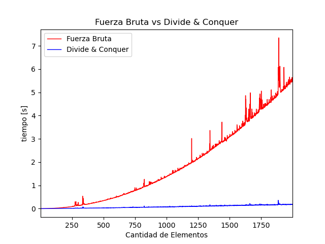

<h1>Trabajo Practico N°1 "Vecinos más Cercanos"</h1>
<h1>Indice</h2>

- [Funciones Auxiliares](#funciones-auxiliares)
	- [**Calculo de Distancia**](#calculo-de-distancia)
	- [***Merge Sort***](#merge-sort)
	- [**Obtención de Coordenadas**](#obtención-de-coordenadas)
	- [**Muestreo de Resultados**](#muestreo-de-resultados)
- [Algoritmos usados](#algoritmos-usados)
- [Algoritmo por Fuerza bruta](#algoritmo-por-fuerza-bruta)
- [Algoritmo por _Divide & Conquer_](#algoritmo-por-divide--conquer)
	- [**Casos Base**](#casos-base)
	- [**Divide**](#divide)
	- [**Conquer: Comparación**](#conquer-comparación)
	- [**Conquer: División por Ejes de X**](#conquer-división-por-ejes-de-x)
	- [**Grafico del Algoritmo**](#grafico-del-algoritmo)
	- [**Tabla de Tiempos**](#tabla-de-tiempos)
- [Análisis de Complejidad Computacional](#análisis-de-complejidad-computacional)
	- [**Complejidad Computacional: Algoritmo por Fuerza Bruta**](#complejidad-computacional-algoritmo-por-fuerza-bruta)
	- [**Complejidad Computacional: Algoritmo por Divide & Conquer**](#complejidad-computacional-algoritmo-por-divide--conquer)
- [Evaluación a Posteriori](#evaluación-a-posteriori)
- [Resolución Final](#resolución-final)
	- [**Reflexión**](#reflexión)
	- [**Problemas y Soluciones**](#problemas-y-soluciones)
	- [**Resultado Final**](#resultado-final)
  

## Funciones Auxiliares
___

Para poder realizar este trabajo fue necesario realizar funciones auxiliares. 

### **Calculo de Distancia**

Primero fue necesario realizar una función en la cual se ingresa con dos puntos y nos devuelva la distancia entre estos. La ecuación que usamos fue la siguiente:

$
d(a,b) = \sqrt{(X_a - X_b)^{2}+(Y_a - Y_b)^{2}}
$

La función que hicimos en Python fue la siguiente:

```python 
def distancia(p1, p2):
	distancia = ((p1[0] - p2[0])**2 + (p1[1] - p2[1])**2)**(1/2)
	return [distancia,p1,p2]
```

En la misma función hicimos que devuelva los puntos con los que se ingresó, así es más fácil identificar a que puntos corresponde la distancia mínima.

### ***Merge Sort***

Siguiendo con los pasos planteados en el trabajo practico tuvimos que ordenar nuestra lista de puntos según su coordenada en "x". Para esto sabíamos que no podíamos utilizar un algoritmo por fuerza bruta dado que el tiempo de ejecución del código sería muy extenso (esta es justamente la problemática del trabajo practico), entonces elejimos un algoritmo recursivo que utilice la misma estrategia de _Divide and Conquer_. En nuestro caso utilizamos el algoritmo de ordenamiento [Merge Sort](https://en.wikipedia.org/wiki/Merge_sort).

### **Obtención de Coordenadas**

El trabajo practico incluía las coordenadas en formato _.csv_, el problema es que era inviable abrir este archivo, seleccionar todos los códigos para despues cargar manualmente todos los valores. Para solucionar esto hicimos una función que separe los números del texto y los guarde como números flotantes en un array bidimensional.

```python
with open(archivo) as csvfile: #TO-DO 2
	L = [(float(x), float(y))  for x, y in csv.reader(csvfile, delimiter=',')]
```
### **Muestreo de Resultados**

Finalmente, para poder conservar la prolijidad del código hicimos una función específica para mostrar todos los resultados relevantes del código, por ejemplo, el archivo utilizado, los puntos más cercanos y su distancia, y el tiempo de ejecución del código.

```python
def mostrar():
	x = time.time() 
	mergeSort(L) #ORDENA EN FUNCION DE COORDENADA X
	resultado = ordenamiento(L)
	x = time.time() - x
	print("Archivo usado =", archivo)
	print("Pa =", resultado[1])
	print("Pb =", resultado[2])
	print("d(Pa,Pb) =", resultado[0])
	print("Tiempo de ejecucion: ",x,"s")
```

## Algoritmos usados
___

## Algoritmo por Fuerza bruta


Según Wikipedia la definición que encontramos de [Fuerza Bruta](https://es.wikipedia.org/wiki/B%C3%BAsqueda_de_fuerza_bruta#:~:text=En%20inform%C3%A1tica%2C%20la%20b%C3%BAsqueda%20por,si%20dicho%20candidato%20satisface%20la) es la siguiente:

>La búsqueda por fuerza bruta es una técnica trivial, pero a menudo usada, que consiste en enumerar sistemáticamente todos los posibles candidatos para la solución de un problema, con el fin de chequear si dicho candidato satisface la solución al mismo.


Para realizar el algoritmo por Fuerza bruta hicimos el siguiente código:

```python
def fuerza_bruta(arr):
	minimo = [math.inf,(0,0),(0,0)] 
	for i in range(len(arr)): 
		for j in range(len(arr)):
			if j <= i:
				continue
			k = distancia(arr[i],arr[j]) 
			if k[0] < minimo[0]:
				minimo = k
	return minimo
```

## Algoritmo por _Divide & Conquer_

La definición de Wikipedia de estos tipos de algoritmos es la siguiente: 

>El método está basado en **la resolución recursiva** de un problema dividiéndolo en dos o más subproblemas de igual tipo o similar. El proceso continúa hasta que éstos llegan a ser lo suficientemente sencillos como para que se resuelvan directamente. Al final, las soluciones a cada uno de los subproblemas se combinan para dar una solución al problema original.

Nosotros por una cuestión de comodidad elegimos basarnos en el algoritmo previamente utilizado _Merge Sort_, ya que conocemos mejor como es la mecánica del código, es decir, como realiza la división de la lista, como se plantean los casos base y como finalmente busca la distancia mínima.

### **Casos Base**

```python
if len(arr) == 2:
	return distancia(arr[0], arr[1])
if len(arr) == 1:
	return [math.inf,(arr[0][0],arr[0][1])]
```

### **Divide**

```python
if len(arr) > 2: # se cumple si lo que retorna es más de un valor 
	med = len(arr)//2
	L1 = arr[:med] 
	L2 = arr[med:]

	res_1 = ordenamiento(L1)
	res_2 = ordenamiento(L2)
```

### **Conquer: Comparación**

```python
if res_1[0] < res_2[0]: # comparo distancias
	res_12 = res_1	
else:
	res_12 = res_2
```
Luego de realizar esta compracion se reasigna el valor de la variable ```res_12```, llamando a la funcion ```puntox``` de la siguiente forma, <br> ```res_12 = puntox(L1, L2, res_12)``` y dentro de la funcion se realiza la segunda parte de *conquer* que ahora será explicada.

### **Conquer: División por Ejes de X**

```python
xLa = La[-1][0]
xLb = Lb[0][0]
new_list = []

for punto in range(len(La)-1, -1, -1): # Agrego todos los puntos de mi lista izquierda
	if abs(La[punto][0] - xLb) < resu[0]:
		new_list.append(La[punto])
	else:
		break

for punto in Lb: # Agrego todos los puntos de mi lista derecha
	if abs(punto[0] - xLa) < resu[0]:
		new_list.append(punto)
	else:
		break

for i in range(len(new_list)): # calculo por fuerza bruta la distancia de todos los puntos de new_list
	for j in range(len(new_list)):
		if j <= i:
			continue
		k = distancia(new_list[i],new_list[j]) 
		if k[0] < resu[0]:
			resu = k
return resu
```
### **Grafico del Algoritmo**


```graphviz
diagraph G{
	Lista -> A
}
```


La funcion "Px" del grafico se encarga de comparar los puntos que esten mas cerca del os extremos de las listas, para el caso de la lista derecha sera el primero y para el caso de la lista izquierda, sera el final. Se buscan quellos puntos cuya distancia en X sea menor que la obtenida en la funcion distancia, si es menor en ese caso se calcula la distancia (ya que antes no contemplamos la distancia en Y), si la nueva distancia resulta ser menor que la previa, entonces acutalizamos el valor y repetimos el mismo ciclo por recursividad.

<asd>Estos graficos y descripciones intentan hacer una representacion grafica lo mas fiel posible del codigo, puede llegar a diferir los procesos representados de lo que realiza el codigo.<asd>
<style>
asd{
	font-size: 10px
}
</style>

### **Tabla de Tiempos**

|Algoritmo por Fuerza|Para 8 Puntos|Para 1 millon de Puntos|
|:---:|:---:|:---:|
|Tiempo Aproximado Teorico|0.00064s|115.74 dias|
|Tiempo Aproximado Real|0.036599s|428.125 dias|

|Algoritmo por D&C|Para 8 Puntos|Para 10 mil Puntos|Para 100 mil Puntos|Para 1 millon de Puntos|
|:---:|:---:|:---:|:---:|:---:|
|Tiempo Aproximado Real [seg]|0|1.57400298118591|49.3134107589721|735.325495004653|

## Análisis de Complejidad Computacional
___
>Teoría de la **complejidad computacional** se centra en la clasificación de problemas de cálculo en función de su dificultad intrínseca, y relacionar estas clases entre sí. Un problema computacional es una tarea resuelto por una computadora. Un problema de cálculo es resoluble por aplicación mecánica de pasos matemáticos, tales como un algoritmo.
>
>Un problema es considerado como inherentemente difícil si su solución requiere importantes recursos, cualquiera que sea el algoritmo utilizado. La teoría formaliza esta intuición, mediante la introducción de matemáticas modelos de computación para estudiar estos problemas y cuantificar su complejidad computacional, es decir, la **cantidad de recursos necesarios para resolverlos**, como el **tiempo y el almacenamiento**

### **Complejidad Computacional: Algoritmo por Fuerza Bruta**

```python
def fuerza_bruta(arr):                  
	minimo = [math.inf,(0,0),(0,0)]      # T(n) = 1
	for i in range(len(arr)):            # T(n) = n
		for j in range(len(arr)):        # T(n) = n-1
			if j <= i:                   # T(n) = 1
				continue                 # T(n) = 1
			k = distancia(arr[i],arr[j]) # T(n) = 1
			if k[0] < minimo[0]:         # T(n) = 1
				minimo = k               # T(n) = 1
	return minimo                        
```
$
	T(n) \in O(n^{2})
$

### **Complejidad Computacional: Algoritmo por Divide & Conquer**



$
	T(n) = n + n + n... = \sum_{i=0}^{log_{2}(n)} n = n + n.log_{2}(n) \in O(n.log_{2}(n)) 
$

## Evaluación a Posteriori
___


## Resolución Final
___
### **Reflexión**

Creemos que es debido a que en el algoritmo de **fuerza bruta** no hay criterio a la hora de escoger las tuplas a comparar, **no hay una lógica**, simplemente compara todo con todo, por más de que en algunas comparaciones sea obvio que los resultados obtenidos no van a ser los que busquemos, y es por eso que tarda tanto más, debido a que, al no utilizar la lógica, hace un montón de operaciones y comparaciones que no debería hacer.

En cuanto al **algoritmo recursivo**, si tiene algo de malo, que es que automatiza muchas cosas, haciendo que no tengamos que pensar todo el proceso, ya que **automáticamente** descarta y da por sentado cosas, sin que nosotros las tengamos que pensar. Y eso, por más que a la hora de resolverlo y de **minimizar los tiempos**, es muy positivo; a la hora de evaluar cuanto es lo que aprendemos con el código no lo es tanto. Ya que de no ser por todos estos procesos automáticos que el código lleva a cabo, nos tendríamos que parar a contemplar y pensar soluciones a un montón de cosas más, y viendo cómo resolverlas. Haciendo que el punto negativo de los algoritmos recursivos es que se pierde un poco de análisis a realizar, y, por ende, algo de aprendizaje.

### **Problemas y Soluciones**

<ins>Primer Problema:</ins> No podíamos exportar los valores del coordenadas1.ccv como números, sino que nos lo interpretaba como texto, cómo caracteres.

<ins>Primera Solución:</ins>
 
```python
with open(archivo) as csvfile:
	L = [(float(x), float(y))  for x, y in csv.reader(csvfile, delimiter=',')]

```

<ins>Segundo Problema:</ins> Cuando hacíamos las divisiones de las listas, a la hora de recibir un resultado, es decir calcular el mínimo, no sabíamos que retornar. Teníamos problemas con los casos base. Además, estábamos respetando mucho el código de MergeSort original y eso nos mareaba un poco. No podíamos obtener un resultado de la parte de Conquer.

<ins>Segunda Solución:</ins> Planteamos bien los casos base. Y después de eso, cuando entendimos la mecánica del código de cómo debería funcionar, pudimos entender cómo hacer bien la parte del divide, y la de conquer. (Entendimos la parte automática que hace el programa.

<ins>Tercer Problema:</ins> Otro problema que tuvimos fue a la hora de llevar a cabo la parte de buscar los ejes de XL y XR, tanto la parte de entender que es lo que se suponía que teníamos que hacer, y después a la hora de codearlo. Un gran problema fue que cuando planteamos esa parte, no lo hicimos recursivamente, por lo que el proceso solo se realizaba una vez con la mitad de la lista izquierda y la mitad derecha. Y es por eso que los resultados nos daban diferentes de lo que nos debería haber dado según lo que nos habías pasado.

<ins>Tercera Solución:</ins> Una vez que entendimos que había que realizar ese paso recursivamente, y entendimos lo que en realidad hace la función, pudimos resolver ese paso de manera correcta.

<ins>Cuarto Problema:</ins> Después, una de las cosas que queríamos hacer era realizar los gráficos de tiempos en un Excel, pero nunca pudimos pasar bien los datos de los tiempos hacia un Excel de manera ordenada.

<ins>Cuarta Solución:</ins> Lo que decidimos fue utilizar la librería "matplotlib.pyplot" para poder plotear los resultados de los tiempos tanto del algoritmo de fuerza bruta como el algoritmo recursivo.

### **Resultado Final**

	Archivo usado "Tupla de 8 Elementos"
	Pa = (1, 2)
	Pb = (1, 1)
	d(Pa,Pb) = 1.0
	Tiempo de ejecucion:  0.0s

	Archivo usado = coordenadas1.csv
	Pa = (7727.420256, 8352.613949)
	Pb = (7727.504707, 8353.293855)
	d(Pa,Pb) = 0.6851307468185359
	Tiempo de ejecucion:  1.574002981185913s

	Archivo usado = coordenadas2.csv
	Pa = (58.2383031, 9978.47222)
	Pb = (58.28449453, 9978.423861)
	d(Pa,Pb) = 0.06687481653416626
	Tiempo de ejecucion:  49.31341075897217s

	Archivo usado = "coordenadas totales.csv"
	Pa = (8800.744546, 3080.64264)
	Pb = (8800.745923, 3080.63524)
	d(Pa,Pb) = 0.007527026571018135
	Tiempo de ejecucion:  735.3254950046539s

